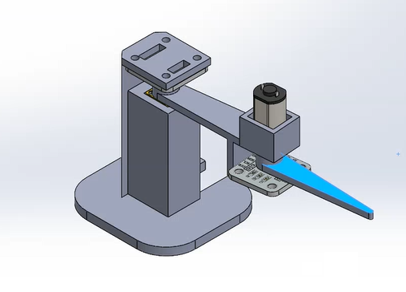

# Robótica – Cinemática Inversa para Brazo de 2 Grados de Libertad

Este proyecto implementa el control de posición angular para un brazo robótico de 2 grados de libertad utilizando un motor DC, un sensor AS5600 (encoder magnético) y un controlador proporcional (P). Está escrito en C++ para la plataforma Arduino.

## 🎯 Objetivo

Permitir el ingreso de un ángulo deseado desde el monitor serie, calcular el error respecto a la posición actual y mover el motor hasta alcanzar el ángulo destino, dentro de una tolerancia de ±1°. El sistema utiliza control proporcional y está limitado físicamente al rango de 0° a 180°.

## ⚙️ Hardware utilizado

- Motor DC con reducción
- Encoder magnético AS5600
- Puente H (controlado mediante IN1, IN2 y ENA)
- Arduino UNO
- Fuente de alimentación externa

## 🧠 Principales características del sistema

### Lectura del sensor
- Conversión de valor RAW (0–4095) a grados (0–360)
- Definición de una referencia inicial (posición 0° al encender)
- Corrección de discontinuidades angulares (salto 360° → 0°)
- Resultado: ángulo relativo en el rango [-180°, +180°]

### Control proporcional
- Error = destino − actual
- Salida de control: `u = Kp × error`
- Saturación del PWM a ±80 para limitar velocidad
- Dirección del motor según el signo de `u`

### Seguridad y robustez
- Limitación del ángulo destino a entre 0° y 180°
- Verificación de conexión del sensor al iniciar
- Filtro de rebote en la entrada serial
- Muestreo fijo cada 5ms para estabilidad del lazo de control

## 📦 Estructura del código

- `setup()`: inicializa serial, encoder y motor. Establece referencia inicial.
- `loop()`: 
  - Lee comandos por serial.
  - Aplica control proporcional cada 5 ms si está en movimiento.
  - Detiene el motor al alcanzar el ángulo deseado dentro de la tolerancia.

## 🖥️ Cómo usar

1. Cargar el código en el Arduino.
2. Abrir el monitor serie a 115200 baudios.
3. Con la Cinematica Directa ingresar un valor en grados (ej: `30` o `-45`).
5. Ahora con cinematica Inversa podemos agregar directamene las coordenadas cartesiandas x e y
6. El motor se moverá la cantidad indicada respecto a su posición actual.

## 📸 Captura

## 📁 Archivos incluidos

- `main.ino`: código completo del sistema
- `screenshot.png`: imagen de referencia visual del proyecto

---

Desarrollado como trabajo integrador para la materia **Fundamentos de Robótica**.  
