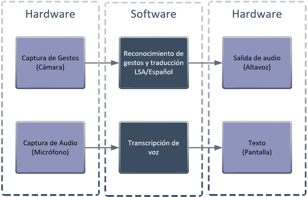
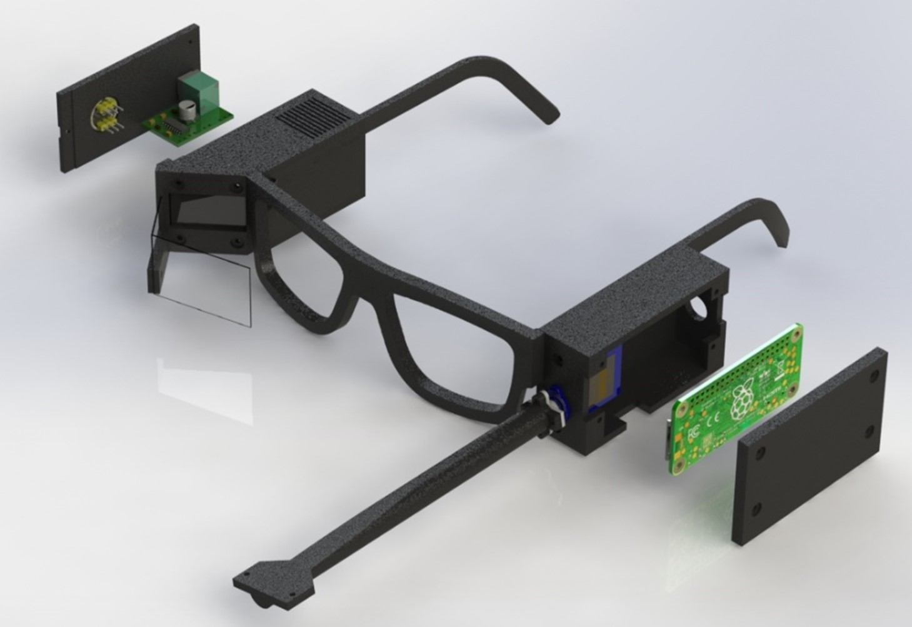
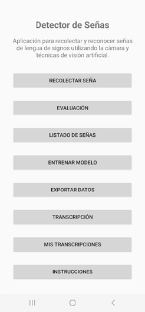

  

# SignApp

“SignApp” es una aplicación móvil desarrollada en el marco de la Práctica Profesional Supervisada de Ingeniería, que ofrece interpretación bidireccional automática entre la Lengua de Señas Argentina (LSA) y el lenguaje oral, sin requerir hardware adicional. Su objetivo es fomentar la inclusión de la comunidad sorda en diversos ámbitos mediante tecnologías de visión por computadora, inteligencia artificial y procesamiento de señales.

---

## 📝 Descripción

SignApp permite:

* **LSA → Texto/Audio:** Reconoce en tiempo real los gestos de LSA mediante la cámara y los landmarks de MediaPipe, traduce la seña a texto superpuesto y la sintetiza en voz clara para oyentes en <300 ms.
* **Audio → Texto:** Captura el habla del interlocutor con el micrófono, envía fragmentos de 10–30 ms a un servicio ASR (Google Cloud Speech-to-Text “es-AR”) y muestra subtítulos semitransparentes.

Ambas funciones corren localmente en el dispositivo, garantizando privacidad y operación offline, con opción de exportar modelos y transcripciones.

---

## 📌 Motivaciones

La comunidad sorda en Argentina enfrenta barreras de comunicación debido a la limitada disponibilidad de intérpretes LSA/E, lo que dificulta el acceso a servicios esenciales como:

* Atención médica en hospitales y centros de salud.
* Educación formal e informal en aulas y cursos.
* Trámites administrativos y legales.
* Comunicación telefónica y social.

Estas carencias generan aislamiento y reducen la autonomía de las personas sordas.

---

## 🎯 Objetivo

Diseñar una aplicación móvil que integre:

1. **Visión por computadora** para detección y clasificación de gestos de LSA.
2. **Procesamiento de audio** para transcripción en tiempo real.
3. **Machine Learning** con modelos ligeros en TensorFlow Lite para ofrecer traducciones con alta precisión (>95 % de confianza) y baja latencia (<50 ms por inferencia).

El propósito final es eliminar barreras comunicacionales y promover la inclusión plena de la comunidad sorda.

---

## 📋 Requerimientos

* **Portabilidad:** fácil transporte y uso cotidiano sin equipo extra.
* **Practicidad:** interfaz intuitiva para usuarios sin experiencia técnica.
* **Autonomía:** procesamiento local sin depender de conexión continua.
* **Ergonomía:** diseño no invasivo y cómodo.

---

## 🛠️ Diseño Funcional

La arquitectura de SignApp se divide en módulos interconectados:

  

*Diagrama de bloques de los módulos de captura, procesamiento e inferencia.*

---

## 🧩 Propuestas

### SignGlasses (hardware) 

* Prototipo con gafas convencionales equipadas con cámara, servomotor SG90, micrófono INMP441, altavoz y pantalla OLED SSD1306 para proyección en campo visual. Fue desarrollado como parte de la catedra de proyecto final de ingeniería mecatrónica por estos mismos autores.

**Ventajas:** autonomía comunicacional, proyección directa, integración ergonómica.
**Limitaciones:** mayor complejidad, consumo energético y necesidad de equipo auxiliar.

  

*Prototipo “SignGlasses Model 2” | Fuente: Elaboración propia - SolidWorks.*

### SignApp (móvil)

* Aplicación Android que procesa vídeo y audio directamente en el smartphone, sin hardware adicional.

**Ventajas:** costo nulo, accesibilidad universal, operación offline.
**Desventajas:** requiere sostener el dispositivo y buena potencia de CPU/GPU.

---

## ⚙️ Tecnología y Arquitectura

* **Captura y preprocesamiento:** MediaPipe Hands extrae 21 landmarks (vector de 63 coordenadas); redimensionado a 224×224 px y filtrado (Kalman, medias móviles) para estabilidad.
* **Inferencia gestual:** TensorFlow Lite con cuantización INT8 y delegate GPU, (<50 ms por clasificación, latencia end-to-end <300 ms).
* **ASR:** Streaming a Google Cloud Speech-to-Text (“es-AR”) con resultados transitorios y finales, puntajes de confianza y alineación con timestamps.
* **NLP:** Corrección gramatical y segmentación de oraciones para salida coherente.
* **TTS:** Text-to-Speech nativo de Android con gestión de cola y parámetros dinámicos de voz, manteniendo latencia <300 ms.

---

## ▶️ Uso

### APK Desarrollador

* **Captura de señas:** Graba nuevas secuencias y etiqueta manualmente.
* **Entrenamiento local:** Ejecuta scripts de Python (`train.py`) con opciones de fine-tuning y exporta modelos cuantizados.
* **Ajuste de parámetros:** Modifica umbrales de confianza, tasas de muestreo y filtros de preprocesado.

### APK Usuario Final

* **Modo Conversación:** Selecciona si la traducción será de LSA a voz o de voz a subtítulos.
* **No Incluye:** Recolección de Señas ni Entrenamiento del Modelo
* **Panel de control:** Ajusta volumen, velocidad de TTS y visualización de subtítulos.
* **Historial:** Accede a transcripciones guardadas y expórtalas en formato `.txt` o compártelas vía mensajería.
  
---

## 📱 Interfaz y Módulos

SignApp ofrece dos variantes APK con menús adaptados:

### Menú Principal

Centro de control para acceder a todos los módulos: captura, inferencia, gestión.

  

### Recolectar Seña

Captura vídeo e imágenes, extrae landmarks, asocia etiquetas y metadatos (timestamp, orientación, nivel de iluminación).

### Evaluación

Pipeline cámara→preprocesador→TFLite→texto/audio, con indicador de confianza (0–100 %).

### Listado de Señas

Listado vertical de etiquetas registradas; versión desarrollador permite eliminación para depuración.

### Entrenar Modelo

Fine-tuning o entrenamiento desde cero de LSTM ligera; exportación a TFLite listo para despliegue.

### Exportar Datos

Empaquetado de TFLite y JSON de configuración; actualización automática en APK público.

### Transcripción

Captura de audio, envío ASR, subtítulos semitransparentes en tiempo real y exportación a `.txt`.

### Mis Transcripciones

Historial de sesiones con fecha/hora, opciones de reproducción, exportación y eliminación.

### Instrucciones de Uso

Incluye guía paso a paso accesible desde el menú principal, explicando cómo operar cada módulo de forma intuitiva.

---

## 📞 Contacto

* **Ignacio E. Gauna** – [gauna.ignaciosh@hotmail.com](mailto:gauna.ignaciosh@hotmail.com)
* **Juan P. Saracino** – [saracinojuanpablo@gmail.com](mailto:saracinojuanpablo@gmail.com)

¡Gracias por tu interés en SignApp! Juntos podemos construir un mundo más inclusivo. 🚀
